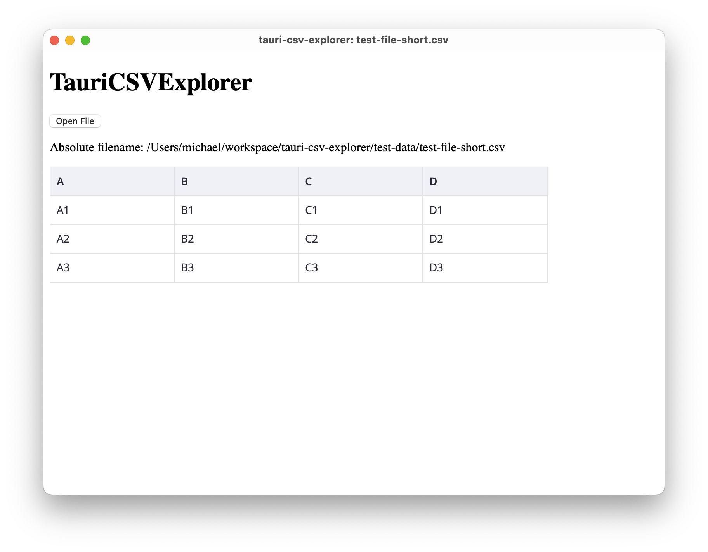

#  tauri-csv-explorer

tauri-csv-explorer is a cross-platform desktop application for viewing and exploring CSV files. It's a demonstration of building a modern desktop app using Tauri, with a robust separation of concerns between a Rust backend and a SvelteKit frontend.

The application has been tested on macOS and Linux (Ubuntu).




## Architecture

This application follows a **clear separation of concerns** pattern.

  * The **backend**, written in **Rust**, handles all the business logic, including file I/O and CSV data processing. This logic is contained in a separate, reusable library (`src-csv`). We use [Polars](https://pola.rs/) to read CSV files. While it may be oversized for this simple use case, it showcases the potential of Rust for Data Science applications.
  * The **frontend**, built with **SvelteKit** and **TypeScript**, provides the user interface. Svelte's speed and simplicity, combined with TypeScript's strong typing, create a fast and reliable user experience. The frontend communicates with the Rust backend via Tauri's `invoke` API.

## Features

The application is built to fulfill the following requirements:

  * **REQ-002 Open CSV File**: A user-friendly button to open and display a CSV file.
  * **REQ-004 Drag & Drop**: Users can drag and drop a CSV file onto the application window to open it.
  * **REQ-003 CLI Argument**: The app can be launched from the command line with a specified CSV file path.
  * **REQ-005 Menu**: A standard application menu with relevant options.
  * **REQ-006 Dynamic Title**: The application window title updates to reflect the currently viewed file.
  * **File Association**: The app is registered to open `.csv` files by default.
  * **Automatic Updates**: The app includes an updater to manage releases and provide seamless updates.

Search for REQ-xxx in the codebase to locate the corresponding code snippets.

## Implementation Details

### CSV Logic Lib (`src-csv`)

The core logic for processing CSV files, including metadata extraction (e.g., delimiter detection), resides in its own Rust crate. This demonstrates how to build a UI for an existing library. A CLI version of this library can be used independently to confirm functionality.

### Svelte UI: Data Grid

For visualizing the CSV data, the [Svelte Datagrid](https://svar.dev/svelte/datagrid/) is used. The chosen component is ideal for handling and displaying tabular data efficiently.

### Application Icon

To change the application icon, use the Tauri CLI:

```sh
pnpm tauri icon path/to/your/icon.png
```

After changing the icon in the `src-tauri` directory, a `cargo clean` is required to ensure the changes are reflected in the build.

### Error Handling

The application leverages Tauri's built-in error propagation. Errors from the Rust backend are automatically sent to the frontend, allowing for unified error handling.

### REQ-002 UI (with button load csv)

#### Add and Configure [Dialog plugin](https://v2.tauri.app/reference/javascript/dialog/)

```sh
pnpm tauri add dialog
```

set permissions in [./src-tauri/capabilities/default.json](./src-tauri/capabilities/default.json): `"dialog:allow-open"`

#### Component for visualizing the CSV-Data

```sh
pnpm install wx-svelte-grid
```

If no `defaultPath` is set, the Path is set first on `$HOME/Documents` and after one selection to the latest used directory.

### REQ-003 CLI Argument FileName

When the Tauri app is started from the CLI, the first positional parameter is the CSV filename. Since we already use existing Clap logic in `src-csv`, the Tauri CLI plugin is not needed !

### REQ-005 Menu

The menu is implemented in TypeScript, as it belongs to the frontend.

### REQ-006 Dynamic Application Title

To set the application title, the following permission must be added:

```sh
pnpm tauri permission add "core:window:allow-set-title"
```

Otherwise, the title will not update, and only an error will appear in the browser console:

```
Unhandled Promise Rejection: window.set_title not allowed. Permissions associated with this command: core:window:allow-set-title
```

### Svelte UI: DataGrid

For visualization the [Svelte Datagrid](https://svar.dev/svelte/datagrid/) is used.

Alternative:
https://github.com/joaquimnetocel/svelte-datatables-net

Error Handling 
https://v2.tauri.app/develop/calling-rust/#error-handling
Errors from the Rust backend are propagated to the Frontend.


### Application Icon

Demo to use a new icon 

```sh
pnpm tauri icon taurirc/assets/icon_csv_text.png
```

After changing the icon in `src-tauri` a `cargo clean` is needed to reflect the changes.

### File Association (`.csv`)

Files with Extension `.csv` should opened with the application.

Implementation:
In [./src-tauri/tauri.conf.json](./src-tauri/tauri.conf.json) add `fileAssociations`:

``` 
  "bundle": {
    "fileAssociations": [
      {
        "ext": [
          "csv"
        ],
        "name": "CSV File",
        "role": "Editor",
        "mimeType": "text/csv",
        "description": "A comma-separated values file."
      }
    ],
```

## Distribute & Release

### Release Creation

Releases are automated using GitHub Actions. The workflow for publishing the app is defined in [.github/workflows/publish-tauri-app.yml](.github/workflows/publish-tauri-app.yml)

### REQ-102 Update Process

When a new release is available it should be installed automatically.
This currently only works for demonstration purposes with an AppImage on Ubuntu ARM.

To support this on macOS Apple the app must be signed (an Apple Developer account is needed).
For Windows a signed release must be created.

Add the plugin

```sh
cargo tauri add updater
```

Tauri updater signs the apps.
So create Tauri Keys

```sh
pnpm tauri signer generate -w ~/.tauri/myapp.key
```

This Keys have to be added to your [./src-tauri/tauri.conf.json](./src-tauri/tauri.conf.json):

```
createUpdaterArtifacts true
  "bundle": {
...  
    "createUpdaterArtifacts": true
  },
  "plugins": {
...
  "updater": {
    "pubkey": "TODO: insert",
    "endpoints": [
        "https://github.com/TODO:user/TODO:repo/releases/latest/download/latest.json"
    ]
  }
```

more:
<https://v2.tauri.app/plugin/updater/#tauri-configuration>

In Github `TAURI_SIGNING_PRIVATE_KEY` and `TAURI_SIGNING_PRIVATE_KEY_PASSWORD` have to be configured as secrets to sign a update release, e.g.:

```sh
echo $TAURI_SIGNING_PRIVATE_KEY | gh secret set TAURI_SIGNING_PRIVATE_KEY
echo $TAURI_SIGNING_PRIVATE_KEY_PASSWORD | gh secret set TAURI_SIGNING_PRIVATE_KEY_PASSWORD
```

## Recommended IDE Setup

[VS Code](https://code.visualstudio.com/) + [Svelte](https://marketplace.visualstudio.com/items?itemName=svelte.svelte-vscode) + [Tauri](https://marketplace.visualstudio.com/items?itemName=tauri-apps.tauri-vscode) + [rust-analyzer](https://marketplace.visualstudio.com/items?itemName=rust-lang.rust-analyzer).

## License: MIT
